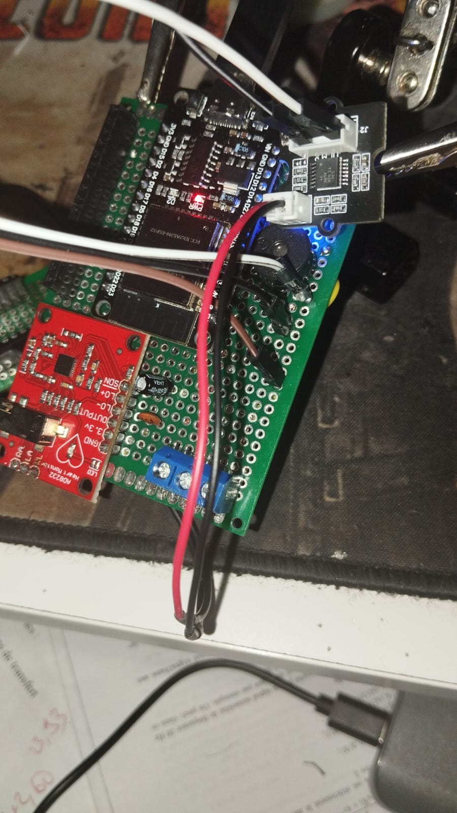
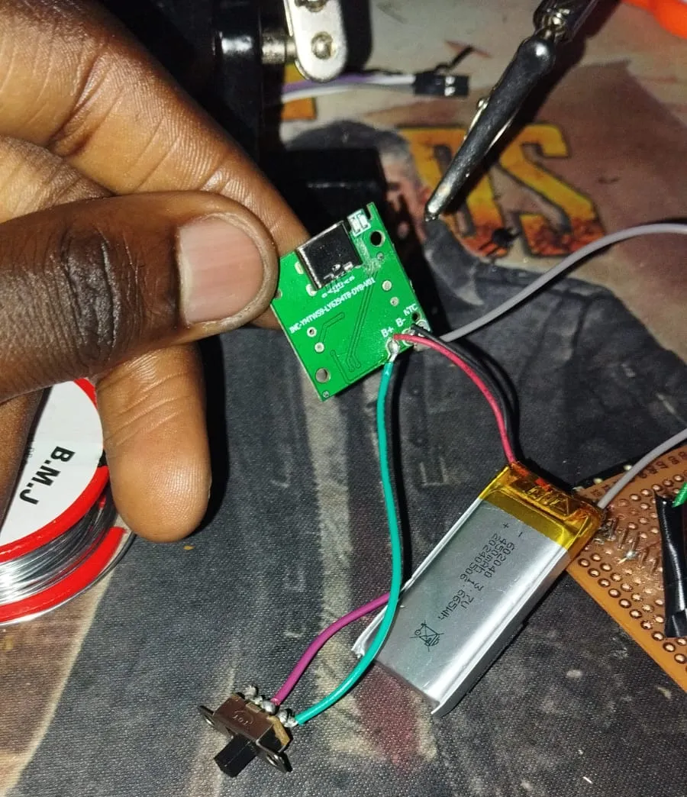
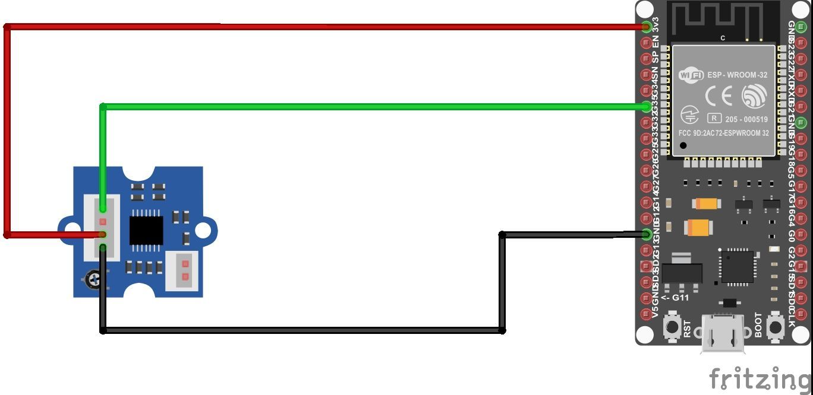
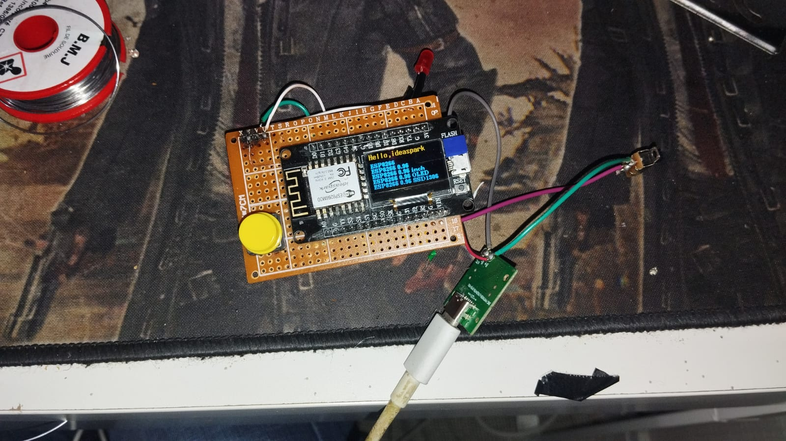
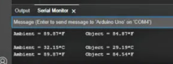
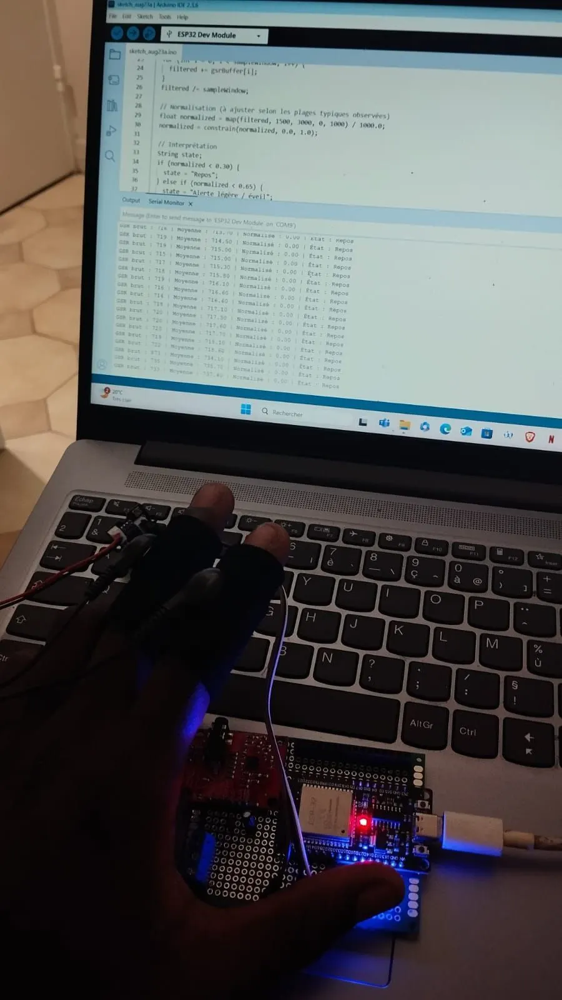
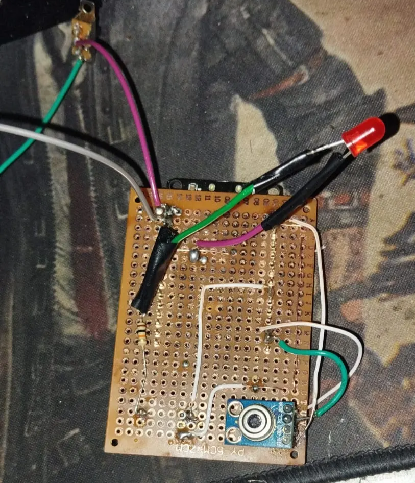

# MedBox — Moniteur GSR avec ESP32



Sous-système fonctionnel du projet **MedBox** consacré à l’acquisition et au traitement d’un signal de **réponse galvanique de la peau** (*Galvanic Skin Response*, GSR) avec un ESP32.

Le prototype lit le signal analogique du capteur, applique un double filtrage numérique, normalise la mesure et affiche un état expérimental dans le moniteur série. Des essais complémentaires d’affichage sur écran TFT sont également présents dans le dépôt.

> **Statut : prototype expérimental en développement.**  
> Ce projet est destiné à l’apprentissage de l’instrumentation embarquée et du traitement de signal. Il ne s’agit pas d’un dispositif médical, ne fournit pas de diagnostic et ne permet pas à lui seul de mesurer ou diagnostiquer le stress.

---

## Objectif

L’objectif de cette étape de MedBox est de construire une chaîne de mesure GSR autonome :

```text
Électrodes → Capteur GSR → Entrée analogique ESP32
→ Filtrage numérique → Normalisation → État expérimental → Moniteur série / TFT
```

La réponse galvanique de la peau évolue notamment avec la transpiration et les conditions de contact des électrodes. Elle constitue un signal physiologique exploratoire qui peut varier selon plusieurs facteurs, dont les mouvements, la pression des doigts, la température cutanée et l’humidité.

---

## Fonctionnalités réalisées

- Acquisition analogique d’un capteur GSR avec un ESP32.
- Lecture de valeurs brutes dans le moniteur série Arduino.
- Moyenne glissante FIR sur 20 échantillons.
- Filtre passe-bas exponentiel IIR avec un coefficient \(\alpha = 0.1\).
- Normalisation du signal filtré entre 0 et 1.
- Interprétation expérimentale de l’état du signal : repos, alerte légère / éveil ou activation élevée.
- Prototype matériel sur plaque perforée.
- Tests avec électrodes destinées aux doigts.
- Tests d’affichage sur écran TFT.

---

## Matériel

| Élément | Rôle |
|---|---|
| ESP32 Dev Module | Acquisition analogique, traitement et affichage des résultats |
| Module / capteur GSR | Mesure indirecte de la conductance cutanée |
| Électrodes pour doigts | Interface de contact avec la peau |
| Plaque perforée | Intégration du prototype |
| Câbles Dupont | Connexion des modules |
| Écran TFT | Affichage expérimental complémentaire |
| Ordinateur + Arduino IDE | Téléversement et visualisation dans le moniteur série |

### Capteur et électrodes




---

## Câblage

Le capteur GSR est alimenté par l’ESP32 et sa sortie analogique est reliée à une entrée ADC du microcontrôleur.



Le câblage réel a été vérifié pendant les essais sur prototype :



> Vérifie la broche analogique définie dans le sketch avant téléversement. Certaines broches ESP32 sont réservées ou ont des limitations selon la carte utilisée.

---

## Traitement du signal

Le signal GSR brut est sensible au bruit et aux variations rapides. Deux filtres sont appliqués successivement afin d’obtenir une mesure plus stable.

### 1. Moyenne glissante FIR

Une fenêtre de 20 échantillons est utilisée :

\[
\bar{x}[n] = \frac{1}{20}\sum_{k=0}^{19}x[n-k]
\]

Cette moyenne réduit les fluctuations rapides de la mesure brute.

### 2. Filtre exponentiel IIR

La moyenne est ensuite filtrée par un filtre passe-bas :

\[
y[n] = \alpha \cdot \bar{x}[n] + (1-\alpha)\cdot y[n-1]
\]

avec :

\[
\alpha = 0.1
\]

Une valeur faible de \(\alpha\) stabilise davantage le signal, au prix d’une réponse plus lente aux changements brusques.

### 3. Normalisation

Le signal filtré est ramené dans l’intervalle \([0,1]\) à partir de valeurs de calibration :

\[
x_{norm} =
\frac{x_{filtré} - x_{min}}
{x_{max} - x_{min}}
\]

La valeur est ensuite limitée entre 0 et 1. Les bornes de calibration doivent être adaptées au capteur, au montage et aux conditions de mesure.

### 4. États expérimentaux

Les seuils utilisés dans le prototype servent uniquement à visualiser l’évolution du signal :

| Valeur normalisée | État affiché |
|---:|---|
| \(\leq 0.30\) | Repos |
| \(0.30 < x \leq 0.65\) | Alerte légère / éveil |
| \(> 0.65\) | Activation élevée |

Ces étiquettes sont des indicateurs techniques liés à un signal GSR calibré. Elles ne représentent pas un diagnostic psychologique, émotionnel ou médical.

---

## Résultats de test

Le moniteur série affiche les valeurs brutes, la moyenne, le résultat du filtrage, la valeur normalisée et l’état expérimental estimé.





### Prototype matériel



---

## Organisation du dépôt

```text
.
├── assets/
│   └── images/
│       ├── gsr_esp32_serial_monitor_test.jpg
│       ├── gsr_esp32_wiring_diagram.png
│       ├── gsr_finger_electrodes_module.jpeg
│       ├── gsr_sensor_esp32_prototype_01.jpg
│       ├── gsr_sensor_esp32_wiring_test.jpg
│       ├── gsr_sensor_module_closeup.jpg
│       ├── gsr_sensor_prototype_breadboard.jpg
│       └── gsr_serial_monitor_output.png
│
├── firmware/
│   ├── esp32-gsr/
│   │   └── esp32-gsr.ino
│   ├── read-value/
│   │   └── read-value.ino
│   └── ecran-TFT/
│       ├── TFT.ino
│       └── data/
│           ├── MedBox.jpg
│           └── MedBox_tft.jpg
│
├── .gitignore
└── README.md
```

## Fichiers principaux

| Fichier | Description |
|---|---|
| [`firmware/esp32-gsr/esp32-gsr.ino`](firmware/esp32-gsr/esp32-gsr.ino) | Acquisition GSR, filtrage, normalisation et affichage dans le moniteur série |
| [`firmware/read-value/read-value.ino`](firmware/read-value/read-value.ino) | Lecture ou test de valeurs du capteur |
| [`firmware/ecran-TFT/TFT.ino`](firmware/ecran-TFT/TFT.ino) | Essais d’affichage sur écran TFT |
| [`firmware/ecran-TFT/data/`](firmware/ecran-TFT/data/) | Ressources graphiques destinées à l’interface TFT |

---

## Utilisation

1. Ouvre le sketch :

   ```text
   firmware/esp32-gsr/esp32-gsr.ino
   ```

2. Dans Arduino IDE, sélectionne une carte ESP32 compatible, par exemple **ESP32 Dev Module**.

3. Vérifie la broche ADC configurée dans le code et réalise le câblage correspondant.

4. Téléverse le programme.

5. Ouvre le moniteur série à la vitesse définie dans le sketch — généralement `115200 bauds`.

6. Observe la valeur brute, les valeurs filtrées, la normalisation et l’état expérimental affiché.

7. Ajuste les limites de calibration et les seuils uniquement après avoir collecté des mesures dans des conditions contrôlées.

---

## Sécurité et limites

- Ce prototype ne doit pas être utilisé pour établir un diagnostic médical, une évaluation clinique du stress ou une décision de santé.
- Le GSR dépend fortement de la qualité du contact, de la pression exercée, de la transpiration, de la température et des mouvements.
- Utilise une alimentation sur batterie ou une solution correctement isolée lorsque des électrodes sont en contact avec le corps.
- Ne raccorde pas un système de mesure corporel à une alimentation secteur ou à un ordinateur non isolé.
- Les seuils de classification dans le code sont expérimentaux et spécifiques à la calibration du prototype.

---

## Évolutions possibles

- Mettre en place une procédure de calibration par utilisateur.
- Enregistrer les séries temporelles GSR en CSV.
- Ajouter un affichage TFT temps réel avec graphe du signal filtré.
- Ajouter une journalisation locale sur carte microSD.
- Mettre en œuvre une communication Wi‑Fi et MQTT.
- Ajouter une interface de supervision dans Home Assistant.
- Étudier l’intégration d’autres capteurs dans MedBox, notamment température, fréquence cardiaque, SpO₂ ou ECG, avec une architecture d’alimentation et d’isolation adaptée.
- Ajouter une enceinte imprimée en 3D et une alimentation sur batterie intégrée.

---

## Auteur

**Joseph Mbode**  
Ingénieur en systèmes embarqués, électronique, instrumentation et génie biomédical.

- GitHub : [@Josephulrich](https://github.com/Josephulrich)
- LinkedIn : [Joseph Mbode](https://www.linkedin.com/in/joseph-mbode)
